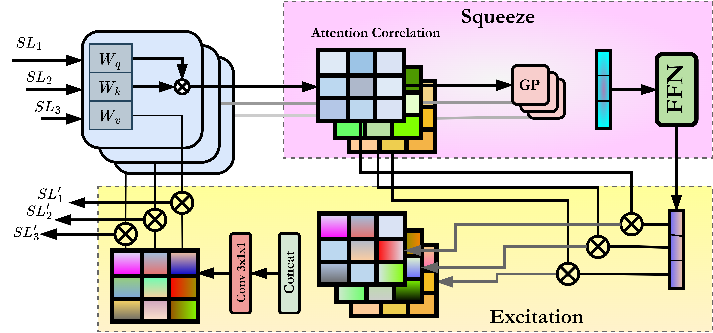

# Inter-scale Context Fusion

The official code for ["_Inter-Scale Dependency Modeling for Skin Lesion Segmentation with Transformer-based Networks_"](https://openreview.net/forum?id=JExQEfV5um).





## Updates
- 1 May., 2023 : Initial release.
- 28 Apr., 2023: Accepted.
- 7 Apr., 2023: Submitted to MIDL 2023 [~~Under Review~~].


## Citation
```latex
@inproceedings{eskandari2023interscale,
    title={Inter-Scale Dependency Modeling for Skin Lesion Segmentation with Transformer-based Networks},
    author={Sania Eskandari and Janet Lumpp},
    booktitle={Medical Imaging with Deep Learning, short paper track},
    year={2023},
    url={https://openreview.net/forum?id=JExQEfV5um}
}
```
---
## Setting up and Training
- In order to run the code and experiments, you need to first install the dependencies and then download and move the data to the right directory.
- For _ISIC 2017-18_ datasets, we used the ISIC Challenge datasets [link](https://challenge.isic-archive.com/data/).
- Run the following code to install the Requirements.

    `pip install -r requirements.txt`
---
### Model weights
You can download the learned weights of the DAEFormer in the following table. 

Task | Dataset |Learned weights
------------ | -------------|----
Skin Lesion Segmentation | ISIC 2017 | [ISCF](https://drive.google.com/file/d/1T-cvswKf1slTqEeXylbKQ-m6KWfRUsJI/view?usp=share_link)
Skin Lesion Segmentation | ISIC 2018 | [ISCF](https://drive.google.com/file/d/1vVR7iqamGprzO9BXO4GzOrejpGdr4p4B/view?usp=share_link)
---
## References
This repo heavily built on the following repos.
- [Swin-Unet](https://github.com/HuCaoFighting/Swin-Unet)
- [SegFormer](https://github.com/NVlabs/SegFormer)
- [MISSFormer](https://github.com/ZhifangDeng/MISSFormer)
---
